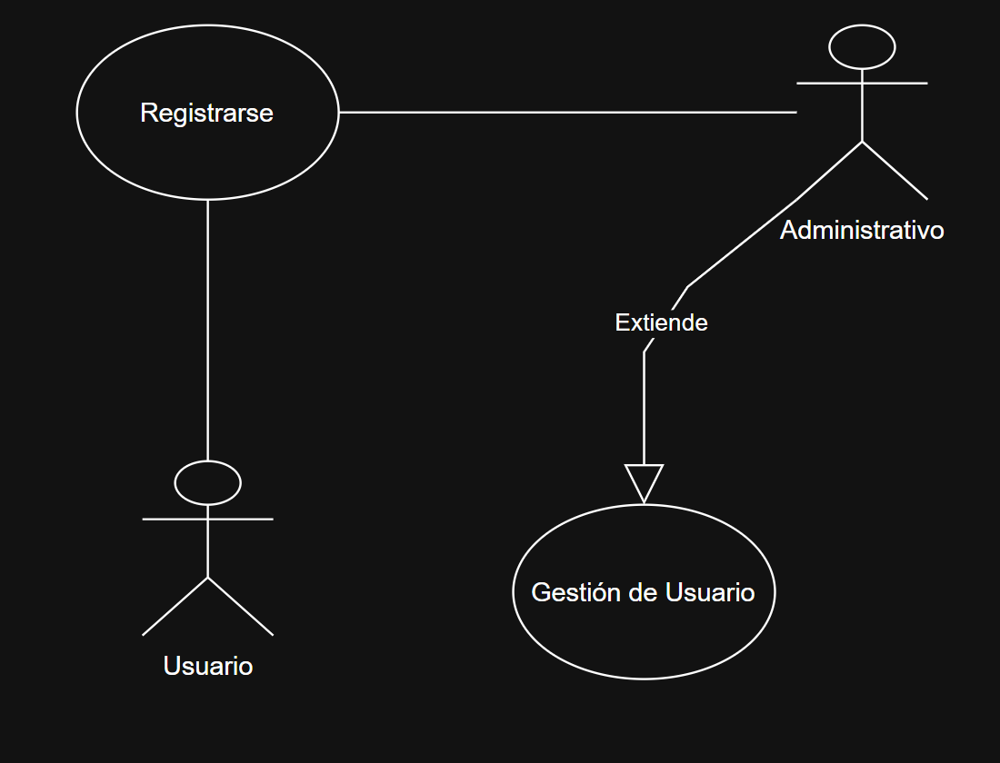
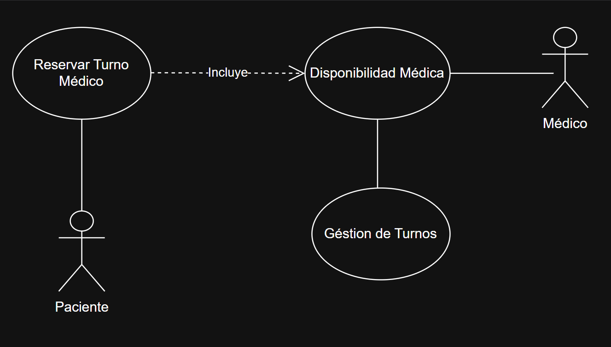
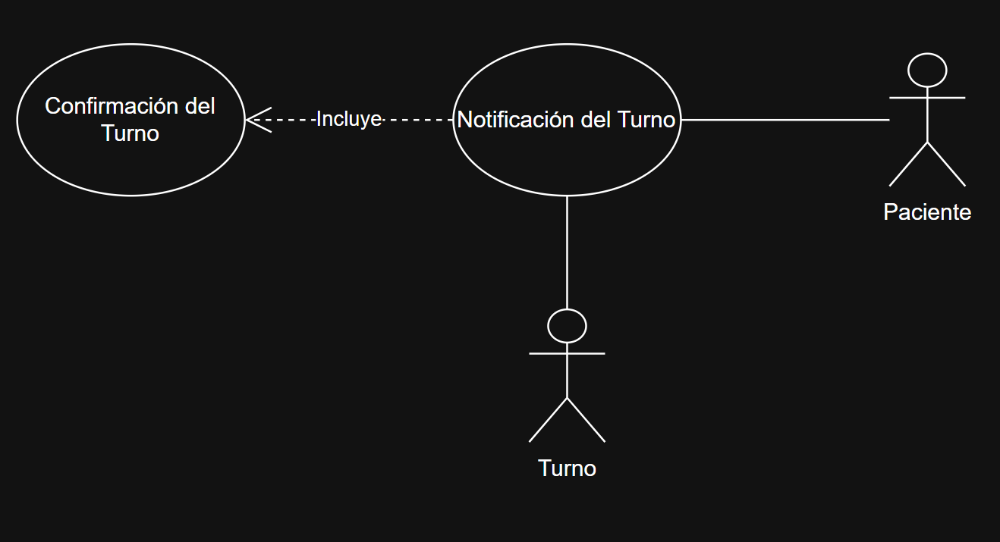
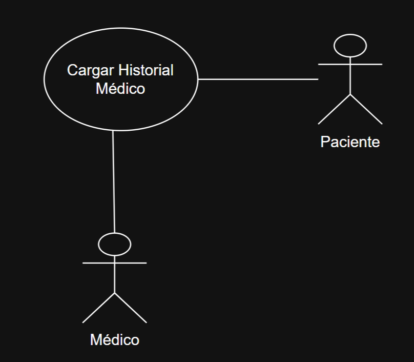
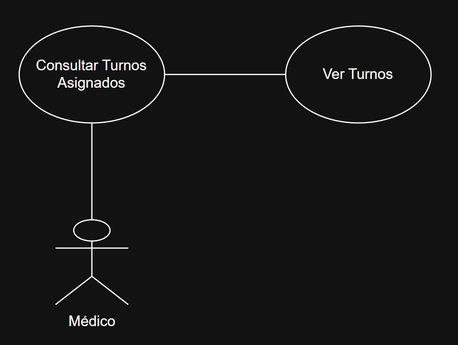

# Diagrama de casos de uso

- **Caso de uso 1 - Registar un nuevo usuario**
#### El usuario accede al sistema y registra sus datos, luego el administrativo puede gestionar el usuario, dependiendo del tipo de usuario.

[Caso 1](https://viewer.diagrams.net/?tags=%7B%7D&lightbox=1&target=blank&highlight=0000ff&edit=_blank&layers=1&nav=1&title=Diagrama%20Caso%20de%20Uso%201.drawio&dark=auto#R%3Cmxfile%3E%3Cdiagram%20name%3D%22P%C3%A1gina-1%22%20id%3D%2208q_R25VppH2O6Z6lk2x%22%3E1VdLc5swEP41HNtByNj46DiPHpIZTz1tk6NitqBWICqEjfvrK0CAZOw4dhNPe0L7aVn28e1KOHielHeCZPEDD4E5nhuWDr52PA%2B5o5F6VMi2QXysgUjQUCv1wJL%2BhvZNjRY0hNxSlJwzSTMbXPE0hZW0MCIE39hq3zmzv5qRCAbAckXYEP1GQxk3aOBNevwT0Chuv4zG02YnIa2yjiSPScg3BoRvHDwXnMtmlZRzYFXy2rw0790e2O0cE5DK17ywxl%2BXTyEtH9jjZBndx7%2FgR%2FJBW1kTVuiAv%2BQFEZRrn%2BW2TYRyP6uWRcJmK8mFg6%2FWICRVqbonz8AWPKeS8lSpPHMpeWIozBiNqg3JM4XGMmFKQGrJC8loCvOueK4Ch4G1XipzUBqQDvQOeAJSbJWK3u3oo1nnBVre9DUcayg2yteqEc2aqLPcJ1YtdG5PyDMe5HmQYEjDWUVYJaU8BTtRghdpCKHOEJRUPlbrj76Wnoyd69IUtoawAEFVPCBaLFWxGYYq8Ul%2FsRZ6U7W0PVahnBdiBcf5JomIQL6g5zd6EFrdOay3UU9%2FTz1bTAAjkq7tnt5XZP2FBacqso5OeGrTCbs7PGni1m%2BZPbhjyBvZhtB4x1CTmIGhmnNd2OfT0B%2FQ8DNENJeCiByGjGRMjdmKiZuYSlhmpK7tRk16m51v0LEosDOzp2GRd8mODQapmoUJTetkKSr95wPSR0fTfdH5OH2X%2BYjM6djNyv3z8fyZ5r9ypgX%2F1Ezr7LRH5PTcmbZjCE0uO9PQ8A5zU0qq6LJnovUcemZ89bM%2B2dpbJxo34i2tHKhJcfwENhiGTj5%2Fz%2Bdc8ErOIe900nWH0l8ybLRzaqJzGTYaHTl%2BDzBMlZpsDbWsUshfcHi80xKue5JfyrHT9MeWvlo0Hr9te3iD9riDXFJnjp0rnFa%2FZqpP3EPX%2FkveAXBwoM7vcAlQYv%2Fr1eS6%2F4HFN38A%3C%2Fdiagram%3E%3C%2Fmxfile%3E)

[Caso nuevo 1](https://viewer.diagrams.net/?tags=%7B%7D&lightbox=1&highlight=0000ff&edit=_blank&layers=1&nav=1&title=Diagrama%20sin%20t%C3%ADtulo.drawio&dark=1#R%3Cmxfile%3E%3Cdiagram%20name%3D%22P%C3%A1gina-1%22%20id%3D%22IMwBz3qv6Sn7OdJglSPO%22%3E1VnbktsoEP0aPyZlCUm2H32bJJtJ1VRmk%2Bw%2BMhKWSZBwYeTLfv02ErqBlDgzvkyeLFqA4HSfQzceoHlyeCfwZv2JR4QN3GF0GKDFwHWdoefBj7IcC4uPtCEWNNKdasMj%2FY%2BUI7U1oxHZtjpKzpmkm7Yx5GlKQtmyYSH4vt1txVn7qxscE8vwGGJmW7%2FRSK4L69gd1fb3hMbr8stOMCneJLjsrHeyXeOI7xsmtBygueBcFk%2FJYU6YAq%2FEpRh31%2FO2WpggqTxlwF%2FR%2B%2FTjXRRtP35brVAy%2FfTl%2B%2FiNnmWHWaY3%2FGWbYUG5XrM8lkDA8jfqMUvYNJRcDNBsR4SkANU9fiLsgW%2BppDyFLk9cSp40OkwZjdULyTdgXcuEQcOBR55JRlMyr5w3BGMscERhU3PO1GcWKU%2Fhw7OtFPxH5QSAb6bXDh8hh15QnApqiFHCEyLFEbqUA5D2jg5Pz9Ptfe3sQJvWDT9PtA3r8IqrmWsPwIN2wu84ZGx5xHIFSaOpCu0amwakgmdpRCKNJTlQ%2BY96fuvr1r%2BNN4tDs3FsNB6IoLAhIrStWAOJLLIYQMM6eSZC8uuQk1jERP6s36Tbcw3P%2BB2eKW2CMCzprr3eLnfpLzxwCjupAgNNjMDwDY8X%2B9SjmrQzJnKC9kQoMCYqgLAmyqOn2vYLAmpiBdRnElNgExZbYscWYyCtKqb2ayrJ4wbnztyDurfj7BzkcwxoXJt8zrDDxyaEZ2NfuYAGWB%2FSkGVHG6gGFKbMVfrXIOoT4%2BEPMIWZ2FXs7OOqOxw32fp2iG5K2MmJjO1zd8Od4zOxc2REDnouO932RK53XXa69gEMh%2BGKigSHdDBHgxlKVfZElDMTTNlNCeu1wXJGCI4Vi7HuVRmLbn5enpFq7qmHo%2Bu9psMRPfdwHBsBdW32eVbwLNOdot10wUvapVzSFch7CMktVCK35J%2Frt%2BCadByXP%2FP6%2BcnnW%2FjdcZFkrKggCvxEkW3YFcVVkRsakRZ0CFcXdpcTrtErSDWc04uCFDZdKCPy%2FdJQpCeTAJWGenDeao1%2BFSmK%2F8elKFXl0TfRpUXyhIpUFfFWia6Ca0UZM%2Bp4rEOXkZXsiOiERhHLJwM9oGn8t7ozWLxxast9PnCBastnzVeUB7rEEj%2FlK1NRxozLCVH0nW0UXjmC%2FmzgL3KLkJB8qcqI5gFI8FbuyVZWOyt3QtM1xLI8jzQhU5rGgSVNE89WpvGFhKkMr6ZSA0cfdRNAWvOYp5gta6shL3Wfe567T3nvO5HyqC%2F4cCZ5l8afJ4k6VQxQj2NeyHzPTJOvXPG7dsX%2FFUgX2RVFhCW%2FbUaDzAyw61zuKigultMguyKbRglN8xsTiIpb3oxe5ArUH7WzSscLOqq6rtxoPLqUD%2ByibnmQFHKcjgsrO%2FEBk9YZJyiad1QtIMewt%2FQ7owKhU8s49OsyrlKPF6qSb9Zs7jPzkcA4r5B5F35heUN20fYODumWtqlJsp4%2FMq4pb77Xk7vdTt4CCz1b0PY0YVhndFhITabheTAxLn1HNiIjpwMR5Pm%2FDQk06%2F%2FXivir%2F6VEy%2F8B%3C%2Fdiagram%3E%3C%2Fmxfile%3E)

---

- **Caso de Uso 2 - Reservar turno**
#### El paciente ingresa al sistema y solicita un turno médico según la disponibilidad horaria del especialista selecionado.

[Caso 2](https://viewer.diagrams.net/?tags=%7B%7D&lightbox=1&highlight=0000ff&edit=_blank&layers=1&nav=1&title=Diagrama%20Caso%20de%20Uso%202.drawio&dark=auto#R%3Cmxfile%3E%3Cdiagram%20name%3D%22P%C3%A1gina-1%22%20id%3D%2208q_R25VppH2O6Z6lk2x%22%3E1VjbUtswEP0aP5aJLTshjyFQ2hmYyTSdljwKa4nVkSVXlnPp11eOJd8EJBQS6FO0q%2FXae%2FYcXeKhabq5ljhLbgUB5gUDsvHQpRcE%2FiAM9U%2Fp2VaeCBnHUlJighrHnP4B%2B6TxFpRA3glUQjBFs64zFpxDrDo%2BLKVYd8MeBOu%2BNcNLcBzzGDPX%2B5MSlVTe82DU%2BL8AXSb2zf5wXM2k2AabSvIEE7FuudCVh6ZSCFWN0s0UWAmexaV67vMTs%2FWHSeDqkAdW6Md8Qejmlt2N5sub5Df8Sj%2F5qEqzwqwwFc9wTHVKMF%2BtthYKXUBWDouUTWIlpIcuViAV1WDd4HtgM5FTRQXXIfdCKZG2AiaMLssJJTLtTVTKtOHroSgUoxymdfsG2umWZqot08Gm5TKlXoNIQcmtDrGzoYHd8C4YG3vddNGGJK0GjowPG94s68wNtHpg0H0J0pGDtIMwcDIpOastLjh0kZKi4ASIgQg2VN2V47PIWIvWzOWmbWxbxgwk1QWB3Ad1LgoZwwHUUVguQT0XOKwCgXSk5rau1ZrokdZYnwSGFV11BfpYv8wbZoLq2mpmoHGXGWjQa3lVuXmqLaheIn%2FYo1g%2FUYWMk2hHn7rsVzBq6DDqG%2BQgV1hq7%2FdCcqF%2Fb70p8iZjQmPh8o0xvY6WPFsnVME8w7uOr%2FVS3uXeWwhy0EXLR64g%2FeCRtp8fTZEjB7%2BvPGbF1l36WsIUGfBSS9xuVr4u%2BoLgPNlp039WtFx%2F913bWDQSLs1GtzvLCvdJ%2BPdrb%2Fxy7dW8fqXQ6p3Pdnw4Pov%2BTWoo3JvqCbE1qWygeHjI4TiCHDuEuqR5Jji9p4wSTDpyxO8qRxSFB8hxeEI5Wra81QZZa62R18JEfhytHXGfC%2B369tp9LuwfpaLT7nM1ud%2BYGP5HXoSPSIxo1FtM%2B2feg4kRdBlWL%2FinIkbgEOO5085%2FdX%2BJhvuPSye9vwTuTfG6Ajvfgaav%2BGCPnfn7bm39c%2FnoeCdNbTY3%2BIrXzf8g6Oov%3C%2Fdiagram%3E%3C%2Fmxfile%3E)

---
  
- **Caso de Uso 3 - Notificar turnos**
#### Cuando un turno cambia de estado (confirmado, cancelado, reprogramado), el sistema envía un correo al usuario.

[Caso 3](https://viewer.diagrams.net/?tags=%7B%7D&lightbox=1&target=blank&highlight=0000ff&edit=_blank&layers=1&nav=1&title=Diagrama%20Caso%20de%20Uso%203.drawio&dark=auto#R%3Cmxfile%3E%3Cdiagram%20name%3D%22P%C3%A1gina-1%22%20id%3D%2208q_R25VppH2O6Z6lk2x%22%3E1VfbctowEP0aP7aDLYzhEUiadibpMEOnJY%2BKtdjqyJIrZDD9%2BspYvoqk0JCWPqE9Wl327B6tcdA8ye8kTuMHQYA53oDkDrpxPM8dDIf6p0D2JeIjA0SSEuPUAEv6E6qVBs0ogU3HUQnBFE27YCg4h1B1MCyl2HXd1oJ1T01xBBawDDGz0W%2BUqLhEx17Q4B%2BBRnF1sjualDMJrpxNJJsYE7FrQejWQXMphCpHST4HVpBX8VKu%2B%2FDMbH0xCVydsmCLvi4fCc0f2CpYRvfxD%2FievPNMNraYZSbiL5nkwlxZ7Sse9O3TYpglbBoqIR0024JUVDN1j5%2BALcSGKiq4dnkSSomk5TBlNComlEg1GquEacPVQ5EpRjnM69wNNGjHZUIttoO8BZk470AkoOReu5hZNDacm6LzAmPvmhQODRS3sle5YVM0Ub1zw6seGGrPoXlk0WwxDJxMi4LVFhccukxJkXECxFAEOVWrYvzeN9Zja%2BYmbxv7lrEASXVAIH9H9UZkMoQT6kZhGYF6ydEIBUhHZ3bqWqnxj6SmwiQwrOi2q85j%2BTInLATVsTWVMelWBhr0Ul5Gbla11dTbaDjobuROehuVzFgbHcqnDvsVFRVYFfVZKLrWegupM0fODPHi2T08x8clrU%2FRr2hRaLuYKlim%2BJDynX7Iu8V3CUUOe3QhW5GudyTv4zeT5Ngi8BMPWbaHl5QpUuCFmHjVqlwd9IzgTXwQp3uSatuarRX8jGq5jnVltjsYrVWF2Sw7WNW6Vyg7OFXZk%2FOV7Y4uJGPUe%2BD7ZXKqjOvuXNVlvwW8tYwnVhXqbrimMrlKGbvutcm4usCFO6t7hkb%2FgtaQd9Vd1PvTLuoH%2Fj%2BVX8Vrq3oWWng6kXYX%2BK%2B%2BgP2gL1TfEuqFvoC12fyJKRPT%2FBVEt78A%3C%2Fdiagram%3E%3C%2Fmxfile%3E)

---
  
- **Caso de Uso 4 - Cargar historial médico**
#### El médico accede al sistema y cambia el hisorial médico de un paciente determinado.

[Caso 4](https://viewer.diagrams.net/?tags=%7B%7D&lightbox=1&target=blank&highlight=0000ff&edit=_blank&layers=1&nav=1&title=Diagrama%20Caso%20de%20Uso%204.drawio&dark=auto#R%3Cmxfile%3E%3Cdiagram%20name%3D%22P%C3%A1gina-1%22%20id%3D%2208q_R25VppH2O6Z6lk2x%22%3E1VZNc5swEP01HJsxCGxzdEmaHOIZz3imTY4K2oA6AlFZ2Li%2FvosRH4J8uBN3OjmhfVqt2LdvFxwSZdWtokW6lgyE481Y5ZBrx%2FPcme%2Fjo0aODRIQAySKM%2BPUA1v%2BG9qTBi05g53lqKUUmhc2GMs8h1hbGFVKHmy3ZynsWwuawATYxlRM0R%2Bc6bRBl96ix%2B%2BAJ2l7szsPm52Mts4mk11KmTwMIHLjkEhJqZtVVkUgavJaXppz317Z7V5MQa7PObAn37ePjFdr8bDYJvfpL%2FiZfSGkCbOnojQZr52IOKuQ8ViaF9fHlg3MoaiXZSZWsZbKIV%2F3oDRHvu7pE4iN3HHNZY4uT1JrmQ0cVoIn9YaWBaKpzgQaLi5lqQXPIeoqOENwmp1JuA4H1QAy2d6CzECrI7q0u0vDvJGeNzf2oS9kYKB0UMOFwaiRTtJF7tnFhSH4b8j2J2RPGIacrWrZopXLHGymlCxzBsxQBBXXD%2FX6KjDW42Dnuhoax4GxAcUxIVAtlmNyTSDfX7TAKdZVGJIW6AOerOPQGod8tXo7WaoYzhCkpioB%2FZZj0DgCsxp4qoZ3qt1iCgTVfG%2B3%2FUsSMDdsJMfcOrGR0BYbmY1U1GRuTg3bdBSom3wmkDuWY8PMJNBJkV3aHxBpMBFphDdShdgd32HTc1oHeWtM4DU4n2vxHlKuYVvQU80P%2BImwBX2JLg9GfM2mXe56LxR%2B%2Bc%2FafD5hcENjjinC5x6oZO6PqA7%2B80BdXHagtoPQtYdg8M4I%2FMC0m3%2FOaYddZ39axyU%2Bf9qNJLUMLzTt0Oz%2FrRr3%2Fg%2BV3PwB%3C%2Fdiagram%3E%3C%2Fmxfile%3E)

---
  
- **Caso de Uso 5 - Consultar Turnos Asignados**
#### El médico ingresa al sistema y ve sus próximos turnos asignados.

[Caso 5](https://viewer.diagrams.net/?tags=%7B%7D&lightbox=1&target=blank&highlight=0000ff&edit=_blank&layers=1&nav=1&title=Diagrama%20Caso%20de%20Uso%205.drawio&dark=auto#R%3Cmxfile%3E%3Cdiagram%20name%3D%22P%C3%A1gina-1%22%20id%3D%2208q_R25VppH2O6Z6lk2x%22%3E3VZNc5swEP01HNsxCH9wdJw0PcQznnEnjY8K2oI6AlEhbNxf38VIIII9dSdJO9MTu0%2Brlfbtk4RHVll9r2iRriUD4QUTVnvk1gsCfxKG%2BGmQY4tMiQESxZkJ6oEt%2Fwl2pkErzqAcBGophebFEIxlnkOsBxhVSh6GYd%2BkGK5a0ARGwDamYox%2B5UynLboI5j3%2BGXiS2pX9WdSOZNQGm0rKlDJ5cCBy55GVklK3VlavQDTkWV7aeZ8ujHYbU5DraybsyeN2x3i9Fk%2FzbfKQ%2FoDv2QeyaNPsqahMxWtvRbxlxHgszcb10bKBNRSNWWViGWupPHKzB6U58vVAn0FsZMk1lzmGPEutZeYELAVPmgEtC0RTnQl0fDRlpQXPYdV1cILguDpTcJMOagcy1d6DzECrI4bY0blh3kgvmBr%2F0DdyZqDU6aGdRo10ki5zzy4ahuA%2FITsakY1Fl5XQVCH8pVK5LNFYlsgUiqUc8Y%2BLoPDRuTmkXMO2oHEzcsCzN%2BT0LegLh%2FRFY%2Fb84Ax9i%2Feiz%2B7HoW9MUM6WzalHL5c5DElRssoZMKMwqLl%2BauyPU%2BPtnJHb2nWOjrMBxbEgUBbLsTgnUePuzIonp0918myuiy0qZaViuOLQomwS0FcIDtjgkhu33Onp9ExLLaZAUM33w6vxXJ%2FNChvJsbZOUSQaKopMXkilrdzMcq%2ByF4nC8MLJtolaZkaJTrLryn6FEu1helsl%2Bq4OO1WeV%2BIr1BNdqZ4w%2BD%2FVQxbDRL49T79RD7aTHp2wogko30VfwUhfj%2BA%2BEf%2FwWSCzv%2FYsoNv%2FHrXc9j%2BZ5O4X%3C%2Fdiagram%3E%3C%2Fmxfile%3E)
