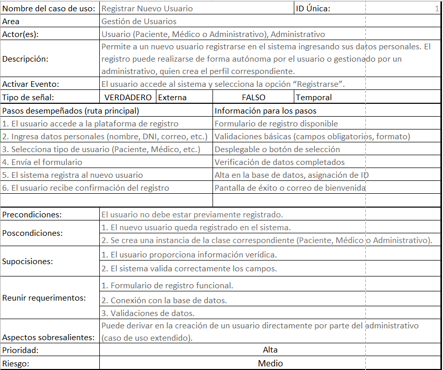
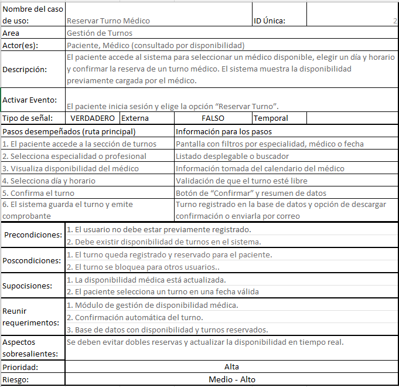
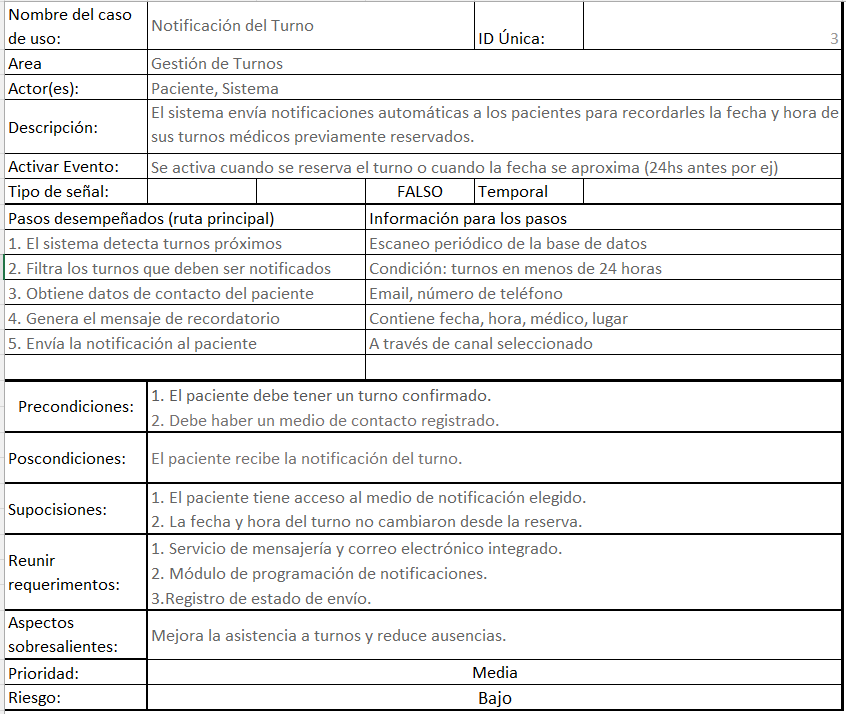
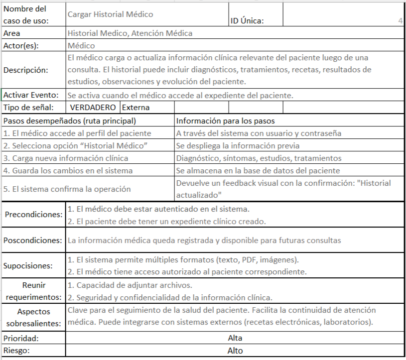
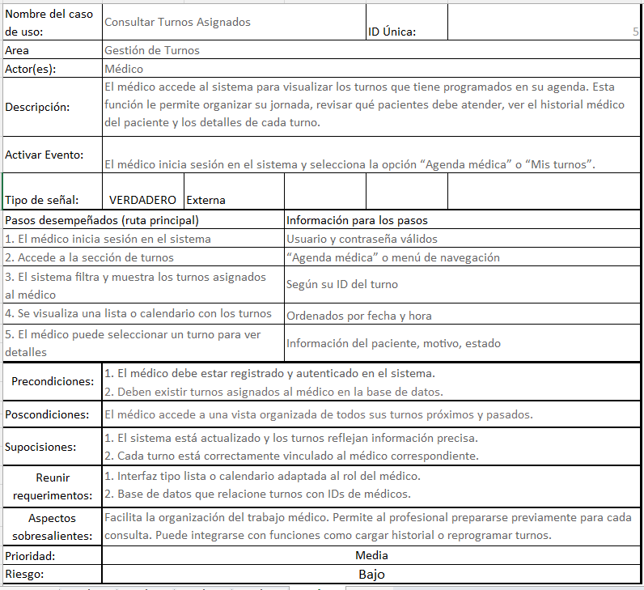

# Escenario de casos de usos

# Registrar Nuevo Usuario
## Descripción
Este caso de uso permite que un nuevo usuario se registre en el sistema. El sistema almacena sus datos personales básicos como nombre, correo electrónico, contraseña, tipo de usuario (paciente o médico), entre otros, y le asigna un ID único.
## Escenario principal
 - Una persona accede al formulario de registro
 - Completa sus datos personales
 - El sistema valida la información ingresada
 - Si es válida, crea una cuenta de usuario y le envía una confirmación
## Condiciones:
 - Precondiciones:
     El usuario no debe estar registrado, y debe cumplir con las normas de registro (correo valido, contraseña segura)
 - Poscondición:
     El usuario queda registrado en el sistema y puede iniciar sesión según su rol asignado.

 

---

# Reservar Turno Médico
## Descripción:
Este caso de uso permite que un paciente reserve un turno médico según la disponibilidad del profesional de salud. El sistema gestiona la agenda médica, evitando conflictos de horario.
## Escenario principal:
- El paciente inicia sesión y accede a la opción “Reservar Turno”.
- Selecciona especialidad, médico y fecha disponible.
- El sistema verifica la disponibilidad.
- Si hay cupo, se asigna el turno y se notifica al paciente.
## Condiciones:
- Precondición: 
   El paciente debe estar registrado e iniciar sesión.
- Poscondición:
   El turno queda agendado para el médico y el paciente.

---

# Notificación del Turno
## Descripción:
Este caso de uso se activa cuando un turno es confirmado, reprogramado o cancelado. El sistema envía una notificación automática por correo electrónico tanto al médico como al paciente.
## Escenario principal:
Se actualiza el estado de un turno (creación, modificación o cancelación).
 - Se actualiza el estado de un turno (creación, modificación o cancelación).
 - El sistema obtiene los datos de contacto de las partes involucradas.
 - Se genera un correo con los detalles del turno y el cambio efectuado.
 - Se envía la notificación.

## Condiciones:
 - Precondición: El turno debe existir en el sistema.
 - Poscondición: El paciente y el médico están informados del estado actual del turno.

---

# Cargar Historial Médico
## Descripción:
Este caso de uso permite que el médico registre o actualice el historial médico de un paciente luego de una consulta. Puede incluir diagnósticos, tratamientos, observaciones y adjuntar archivos.

## Escenario principal:

 - El médico inicia sesión y accede al perfil del paciente.
 - Selecciona la opción de “Historial Médico”.
 - Ingresa nueva información clínica.
 - Guarda los datos en el expediente del paciente.

## Condiciones:

 - Precondición: El paciente debe tener un perfil clínico.
 - Poscondición: La nueva información queda registrada y disponible para futuras consultas.

---

# Consultar Turnos Asignados
## Descripción:
Este caso de uso permite al médico visualizar su agenda de turnos, organizando su jornada laboral. Puede ver datos del paciente, estado del turno y aplicar filtros por fecha.
## Escenario principal:
 - El médico inicia sesión.
 - Accede a su “Agenda médica”.
 - El sistema muestra la lista de turnos asignados.
 - El médico puede seleccionar un turno para ver detalles.
## Condiciones:
 - Precondición: El médico debe estar autenticado y tener turnos asignados.
 - Poscondición: El médico tiene acceso a una vista organizada de su agenda médica.

